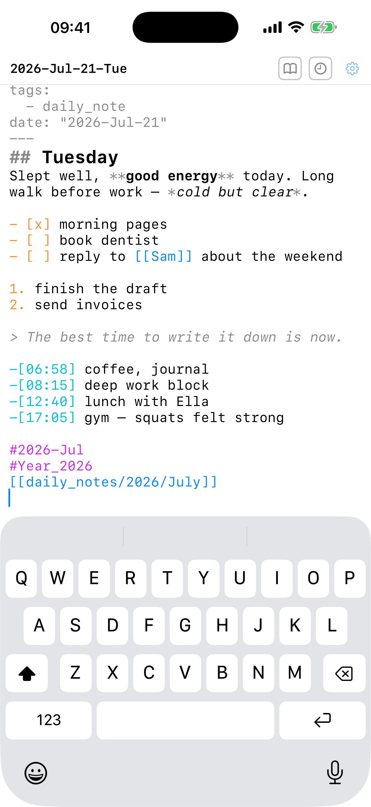
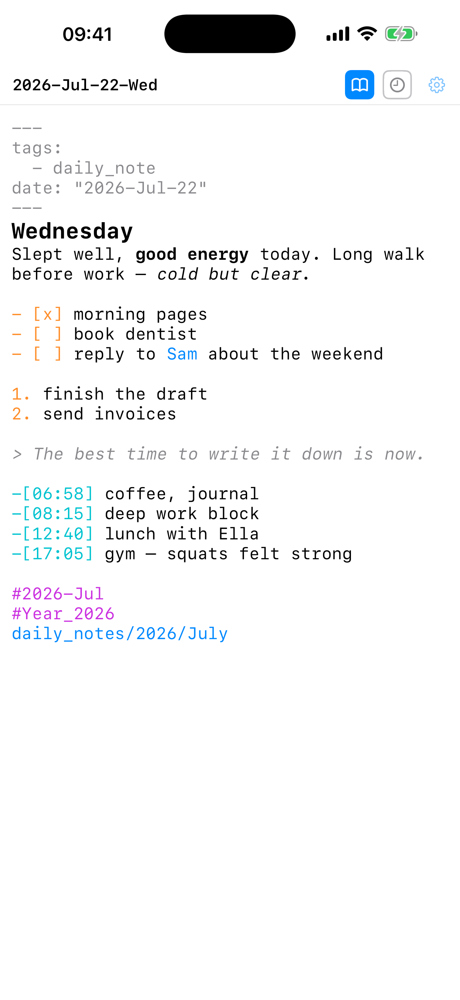
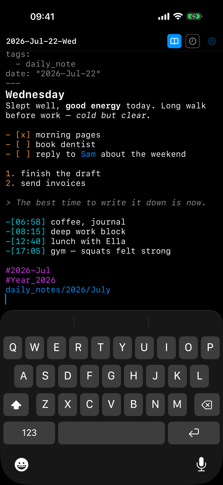

# DailyNote

**Today's daily note, instantly.** A one-purpose iOS companion for markdown
daily notes in iCloud Drive (built for Obsidian vaults, works with any folder):
cold launch straight into today's note — keyboard up, cursor at the end —
creating it from your template if it doesn't exist yet.

<p>



</p>

## Why

Full-featured notes apps index, sync, and animate before you can type. If you
just want to capture a thought into today's note, that launch delay is where
the thought dies. DailyNote does exactly one thing and does it in well under a
second — and it works on the *same markdown files*, so your main app (Obsidian
or anything else) stays the source of truth.

## Features

- **Instant open** — the last saved content appears the moment the app
  launches; the file is reconciled with iCloud in the background. Unsaved
  typing always survives, and if both you and another device appended to the
  note, the edits are merged.
- **Template-based creation** — if today's note doesn't exist, it's created
  with your daily-note template, `{{date:...}}` placeholders rendered exactly
  as Obsidian renders them (moment.js tokens, including the `YYYY`/`DD`
  ICU pitfalls handled correctly).
- **Live markdown styling** while you type: headings, bold/italic/strike,
  `code`, [[wikilinks]], links, #tags, lists, checkboxes, quotes, dimmed YAML
  frontmatter. Styling only — the file bytes are exactly what you typed.
- **Markup mode** (book toggle) — renders the markdown in place, Obsidian
  Live-Preview style: syntax concealed, `[[target|alias]]` shows the alias,
  headings sized, links tappable-looking — while staying fully editable. The
  paragraph under the cursor reveals its raw markdown.
- **Smart lists** — Return continues `-`/`*`/`+` bullets, numbered lists
  (auto-increment), and checkboxes (new items unchecked); Return on an empty
  item exits the list.
- **Line timestamps** (clock toggle) — every Return starts the new line with
  `-[HH:MM] `, for logging a day as it happens.
- **Sync-safe** — all file I/O goes through `NSFileCoordinator`; the app
  never overwrites a note that already exists elsewhere, watches for external
  changes while open, and autosaves on every pause and app switch.
- **No animations, no accounts, no network code.** See [PRIVACY.md](PRIVACY.md).

## Requirements

- iOS 17+, Xcode 16+
- A folder of markdown daily notes reachable through the Files app (an
  Obsidian vault in iCloud Drive is the canonical case)

## Install

1. Clone, open `DailyNote.xcodeproj`, and select your own team under
   *Signing & Capabilities* (any free or paid Apple ID works — the app needs
   zero entitlements).
2. Run to your iPhone. On a free Apple ID the app must be re-run from Xcode
   every 7 days; a paid membership extends that to a year.
3. On first launch, tap **Choose Vault Folder** and pick the folder that
   contains your `daily_notes` directory (e.g. your vault root in
   Files ▸ Obsidian). That's the only setup.

## Adapting to your vault

The daily-note layout is currently defined by constants in
[`MomentFormat.swift`](DailyNote/MomentFormat.swift) (`VaultConfig`):

| Constant | Default | Meaning |
|---|---|---|
| `dailyNotesFolder` | `daily_notes` | Folder inside the vault |
| `dailyNoteFormat` | `YYYY/MMMM/YYYY-MMM-DD-ddd` | Note path/name (moment tokens; `/` nests folders) |
| `templatePath` | `daily_notes/0000.md` | Template file, with `{{date:...}}` placeholders |

Match these to your daily-notes settings (in Obsidian:
`.obsidian/daily-notes.json`) and rebuild. Reading that config file
automatically is on the roadmap.

## How it stays fast

- Keystrokes never enter SwiftUI: text lives in unobserved model state and
  the `UITextView` is the source of truth while editing.
- Markdown styling is attribute-only work scoped to the edited paragraph;
  markup-mode concealment is a custom attribute rendered as null glyphs by an
  `NSLayoutManager` delegate — the text is never transformed for display.
- Launch shows a locally cached copy of today's note immediately and lets the
  (potentially slow) iCloud coordinated read finish in the background.

## Development

Sources live in `DailyNote/` as a filesystem-synchronized group — add a file
to the folder and Xcode picks it up. The pure-logic pieces (`MomentFormat`,
`VaultFileService`) are Foundation-only and unit-testable from the command
line on a Mac:

```sh
swiftc -o /tmp/t DailyNote/MomentFormat.swift DailyNote/VaultFileService.swift your-test-main.swift && /tmp/t
```

A DEBUG-only launch argument `--test-vault <path>` bypasses the folder picker
and uses a local directory as the vault — handy for simulator smoke tests:

```sh
xcrun simctl launch <sim> com.alex.dailynote --test-vault /path/to/fake/vault
```

Tip: keep `xcodebuild` derived data outside iCloud-synced folders
(`-derivedDataPath /tmp/...`), or the build database can fail with disk I/O
errors.

## License

[MIT](LICENSE)
